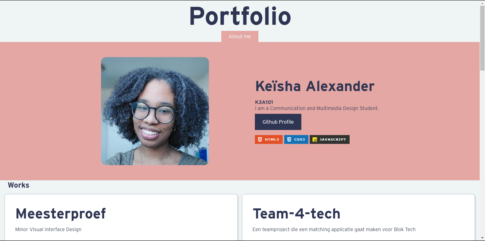
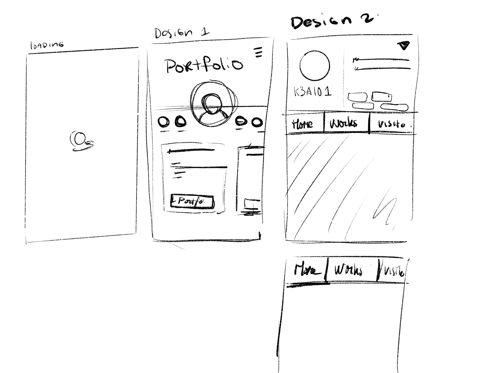
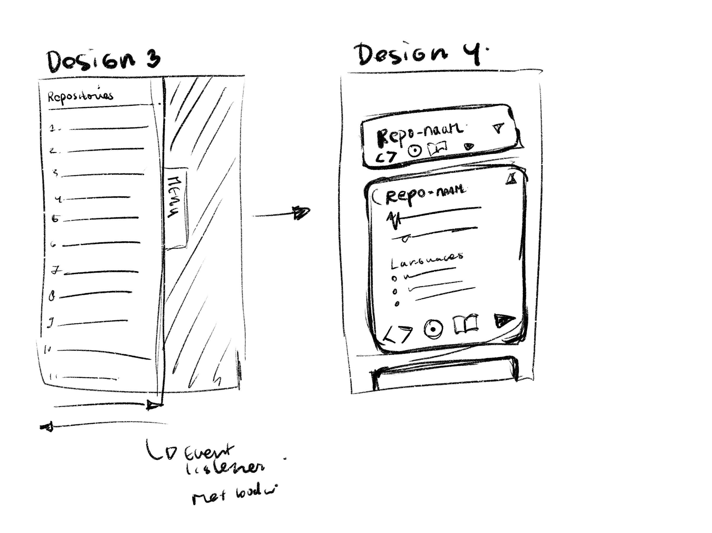

# Github portfolio
Mijn portfolio is een onepage single page application. Het bestaat namelijk uit mijn persoonlijke gegevens en mijn projecten. Ik heb mijn portfolio gemaakt met vanilla HTML, CSS en JavaScript. Verder heb ik de Github API gebruikt om het data van mijn Github account te gebruiken als inhoud. De inhoud in mijn portfolio zijn mijn persoonlijke gegevens, mijn gepinde repositories en details van mijn repository. 

## Inhoud
- [Concept]()
- [Het Proces]()
- [Opdracht]()
- [Eisen voor portfolio]()
- [Ideegeneratie]()

--- 
# Het Proces
## Opdracht
In de project week  ga ik de kennis van CSS to the rescue  en Web App from scratch toepassen in het project. Voor het project ga ik een portfolio maken met de Github API. In de github API staan alle informatie van mijn github account bijvoorbeeld mijn repositories. Mijn portfolio moet een singlepage met verschillende "webpagina's". 

## Eisen voor portfolio
### Functionaliteiten
- [x] Fetch data uit Github API
- [x] Overzicht van al mijn repositories
- [x] Details van de repository zoals  link naar readme, link naar live demo en de gebruikte programeer talen.
- [ ] Thumbnail van de live demos
- [x] Progressive disclosure om meer informatie zichtbaar laten maken als je op mijn gebruikersnaam of button klikt 
- [ ] Loading state
- [ ] Geanimeerde Navigatie menu met haschange event
- [ ] 

### Portfolio inhoud
- [x] Mijn github gebruikersnaam
- [x] Mijn github profiel foto
- [x] Korte beschrijving over de soort ontwerper die ik ben 
- [x] Mijn repositories
- [ ] Programeertalen die ik ken
- [ ] Afbeelding toevoegen bij de Repository

### CSS Technieken
- [ ] Scroll-snap
- [x] has() selector
- [ ] 3D Transform animatie
- [x] Transform-property

---

## Ideegeneratie 
Vervolgens heb ik wat inspiratie opgedaan op de manier hoe mijn portfolio eruit gaat zien. Ik heb verschillende schetsen gemaakt voor mobe versie als desktop versie. Toen ik de schets maken was ik heel erg ambitieus. Maar ik kon ze niet implementeren want ik had niet genoeg tijd daarvoor om alles te doen die ik wilde doen. Dus nu lijk het een beetje simpel. 

### Schets 1

### Schets 2

### Schets 3

### Schets 4

### Schets 5 

Uiteindelijk heb ik een schets 6 gekozen die ik veder ging uitwerken. 
### Schets 6 

---
## Code 

